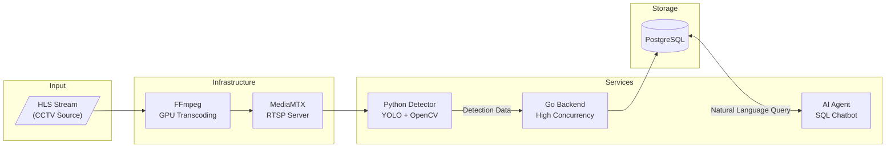

# VisionAI

[](https://python.org)
[](https://golang.org)
[](https://docs.ultralytics.com)
[](https://docker.com)
[](LICENSE)

**Fullstack Computer Vision CCTV Analytics Platform for Traffic Monitoring**

Real-time traffic analytics system that processes CCTV streams using deep learning, built with Clean Architecture principles. Designed for scalability with a polyglot microservices approach — Python for computer vision & AI, Go for high-performance data processing.

---

## Architecture



### Why This Stack?

| Service | Language | Rationale |
|---------|----------|-----------|
| **Detector** | Python | Rich ML/CV ecosystem (Ultralytics, OpenCV, PyTorch) |
| **Backend** | Go | Superior concurrency with goroutines for handling multiple CCTV streams, lower memory footprint |
| **AI Agent** | Python | LLM libraries and agentic frameworks availability |

---

## Features

### Implemented
- [x] **Real-time Vehicle Detection** — YOLO-based object detection with GPU acceleration
- [x] **RTSP Stream Processing** — Low-latency video pipeline with MediaMTX
- [x] **GPU-Accelerated Encoding** — NVENC hardware encoding for output streams
- [x] **Clean Architecture** — Hexagonal/Ports-Adapters pattern for maintainability

### Roadmap
- [ ] **Vehicle Counting** — Track and count vehicles passing through defined zones
- [ ] **Traffic Density Analysis** — Real-time congestion level monitoring
- [ ] **Crowd Forecasting** — Predict traffic patterns using historical data
- [ ] **SQL Agent Chatbot** — Natural language interface to query analytics data

---

## Tech Stack

### Python Detector
| Technology | Purpose |
|------------|---------|
| Python 3.12 | Runtime |
| Ultralytics YOLO | Object detection model |
| OpenCV | Video capture & processing |
| Pydantic | Data validation & settings |
| FFmpeg + NVENC | GPU-accelerated stream output |

### Go Backend (Planned)
| Technology | Purpose |
|------------|---------|
| Go 1.22+ | Runtime |
| PostgreSQL | Time-series detection storage |
| goroutines | Concurrent stream handling |

### AI Agent (Planned)
| Technology | Purpose |
|------------|---------|
| Python | Runtime |
| LangChain/LlamaIndex | Agentic framework |
| LLM | Natural language to SQL |

---

## Clean Architecture

The Python Detector follows Clean Architecture / Hexagonal pattern:

```
python-detector/
├── app/
│   ├── domain/           # Enterprise business rules
│   │   ├── bbox.py       # Bounding box value object
│   │   ├── detection.py  # Detection entity
│   │   └── frame.py      # Frame entity
│   │
│   ├── usecases/         # Application business rules
│   │   ├── ports.py      # Abstract interfaces (ports)
│   │   └── detect_objects.py  # Detection use case
│   │
│   ├── adapters/         # Interface adapters
│   │   ├── vision/
│   │   │   └── yolo_detector.py  # YOLO implementation
│   │   └── video/
│   │       ├── rtsp_stream.py    # RTSP input adapter
│   │       └── rtsp_writer.py    # RTSP output adapter
│   │
│   ├── utils/            # Utilities
│   └── main.py           # Composition root
```

**Key Principles:**
- **Domain** — Pure business entities, no external dependencies
- **Usecases** — Application logic, depends only on domain and ports
- **Adapters** — Implementations of ports (YOLO, RTSP, etc.)
- **Dependency Rule** — Dependencies point inward, outer layers depend on inner layers

---

## Project Structure

```
visionai/
├── python-detector/      # Computer vision service
│   ├── app/              # Application code (clean architecture)
│   ├── models/           # YOLO model weights
│   ├── Dockerfile
│   └── pyproject.toml
│
├── go-backend/           # Data processing service (planned)
│
├── ai-agent/             # LLM SQL agent (planned)
│
├── docker-compose.yml    # Infrastructure orchestration
├── mediamtx.yml          # RTSP server configuration
└── .env                  # Environment variables
```

---

## Getting Started

### Prerequisites

- **Docker** & **Docker Compose**
- **NVIDIA GPU** with CUDA support
- **NVIDIA Container Toolkit** for GPU passthrough
- **uv** (Python package manager) — for local development

### Installation

1. **Clone the repository**
   ```bash
   git clone https://github.com/evanhfw/visionai.git
   cd visionai
   ```

2. **Configure environment variables**
   ```bash
   cp .env.example .env
   # Edit .env with your CCTV stream URL
   ```

3. **Start infrastructure services**
   ```bash
   docker compose up -d mediamtx ffmpeg-hls
   ```

4. **Run the detector** (local development)
   ```bash
   cd python-detector
   uv sync
   uv run python -m app.main
   ```

### Configuration

Create a `.env` file in the project root:

```env
# Input stream (HLS/RTSP source)
STREAM_SOURCE_HLS_URL=https://your-cctv-stream.m3u8

# Internal RTSP relay
STREAM_RELAY_RTSP_URL=rtsp://mediamtx:8554/cam1

# Detection output stream
STREAM_RTSP_OUT_URL=rtsp://localhost:8554/detected

# Model path
VEHICLE_DETECTOR_MODEL_PATH=models/yolo11m.pt
```

---

## Usage

### Viewing the Detection Stream

Once running, access the annotated video stream:

- **RTSP**: `rtsp://localhost:8554/detected`
- **WebRTC**: `http://localhost:8889/detected`

### Keyboard Controls

| Key | Action |
|-----|--------|
| `Q` | Quit the detector |

---

## Roadmap

- [x] Phase 1: Real-time detection pipeline
- [ ] Phase 2: Go backend + PostgreSQL integration
- [ ] Phase 3: Vehicle counting & traffic density
- [ ] Phase 4: AI Agent with SQL chatbot
- [ ] Phase 5: Dashboard & visualization

---

## Author

**Evan Hanif Widiatama**

- GitHub: [@evanhfw](https://github.com/evanhfw)

---

## License

This project is licensed under the MIT License — see the [LICENSE](LICENSE) file for details.
